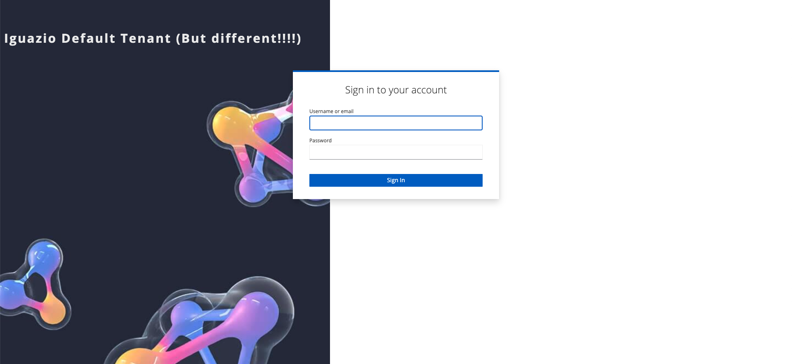

# Creating a theme for Keycloak

We would like to customize (at least) the login screen for Keycloak such that it will contain the Iguazio logo and match in palette and style to the Iguazio login screen. 
This can be done by creating a custom theme in KC, and setting the default-tenant realm to use that theme for the login screen. This page will cover these steps.

Generally speaking, the best source of information is the KC documentation - https://www.keycloak.org/docs/23.0.3/server_development/#creating-a-theme

## Creating a Keycloak theme 

See the page referenced above for details on exactly how to create a new theme, and what the directory structure is for that.
I've included here an example of a minimal theme which modifies the login screen by changing the background image, and changing where the text is located in that screen. The example contains the following files:

* An `igz-theme` folder - this indicates the name of the theme (`igz-theme`)
* Within it a `login` folder - this means that we override the behavior of the login screen.
* Within it, a `theme.properties` file - this tells KC general data about the theme and it points to the css file that we add (all this does is basically override the css definitions of the original theme).
* `css` and `img` folders which contain, surprisingly enough, css and image files. A single file is contained in the `css` folder and it overrides some styles that the KC theme is defining, making them look differently.

The resulting login screen when using the example theme included here looks like this:


## Deploy a theme to Keycloak pod

### Adding the theme files to Keycloak

The files for any custom template can be deployed in one of two ways (see https://www.keycloak.org/docs/23.0.3/server_development/#deploying-themes):

* Copy the file heirarchy to the `/opt/bitnami/keycloak/themes/` directory in the keycloak pod (note that this is not the path written in the KC docs, but it is this way because we use the bitnami KC deployment). In the example provided, this will create an `/opt/bitnami/keycloak/themes/igz-theme` folder, and the theme is named `igz-theme`. The folder name determines the name of the theme to be used. I used this method and validated it works properly.
* Alternatively, the docs mention that a JAR file can be created with the theme contents and placed in the `/opt/bitnami/keycloak/providers` location. I didn't validate this method works.

In either of these options, files need to be added to the KC pod deployed. Since we are using a Helm chart deployment, it makes it more complicated. I didn't really explore methods to modify the Helm deployment (I manually added a `hostPath` to the pod, lazy me), but looks like the best approach would be to add an `initContainer` which at at runtime will copy the needed files -
* It can pull from Git (will not work for dark sites) the needed files into the correct location on the KC container.
* Also, we could create a minimal image that contains those files (which are not expected to change very frequently), and use that image as an init-container, copying from local storage into the KC container

### Modifying the `default-tenant` realm to use the theme

Once files are in place, any realm can be set to use this theme instead of the default one. This can be done from the UI like described here - https://www.keycloak.org/docs/latest/server_admin/index.html#_themes

When importing a realm from file (as we do), set the following properties for the given realm:
```
{
  "loginTheme": "igz-theme",    # sets the theme for the login page, which is the one we must change.
  "accountTheme": "",           # this sets the account mgmt pages, which is not very useful.
  "adminTheme": "",             # this sets the admin console, which is what the realm admin will use to configure IDPs.
}
```

These properties need to be included in our realm configuration data that is placed in a secret in our current deployment.